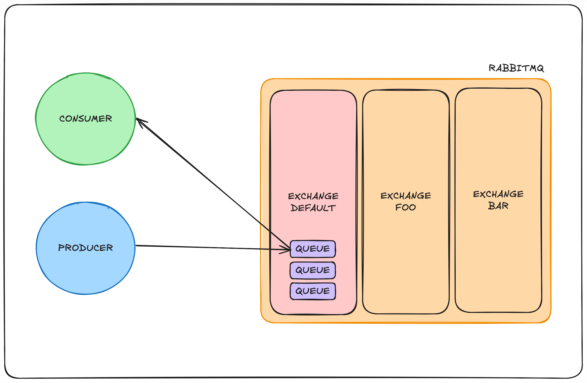

# RabbitMQ: Consumer/Producer

- RabbitMQ is a reliable and mature messaging and streaming broker.
- AMQP 0-9-1 (`Advanced Message Queuing Protocol`) is a messaging protocol.

## Exchanges

- `Messages` are published to `exchanges`.
- `Exchanges` take a message and route it into zero or more `queues`.
- The `default` exchange is a `direct` exchange with no name pre-declared by the broker.
- A `direct` exchange delivers messages to queues based on the message routing key.
- `Exchanges` can be durable or transient.

## Queues

- A `queue` in RabbitMQ is an ordered collection of `messages`. 
- `Messages` are enqueued and dequeued (delivered to consumers) in a FIFO manner.
- `Queues` have names so that applications can reference them.
- `Queues` can be durable or transient.

## Components

### Consumer

- `Consumers` can be short lived.
- `Consumers` are typically registered during application startup.
- `Consumers` can subscribe to have RabbitMQ push enqueued messages (deliveries) to them.
- When registering a consumer we can choose one of two delivery modes:
    - `Automatic` (deliveries require no acknowledgement, a.k.a. "fire and forget").
    - `Manual` (deliveries require client acknowledgement).

### Producer

- `Producers` are often long lived.
- `Producers` are typically registered during application startup.
- `Producers` can push enqueued messages (deliveries) to certain queues in certain exchanges.

## Example

- A `producer` (sender) that sends a single message.
- A `consumer` (receiver) that receives messages and prints them out.
- A `queue` is the name for the post box in RabbitMQ. 
- Before sending we need to make sure the recipient queue exist.
- In `RabbitMQ` a message can never be sent directly to the `queue`, it always needs to go through an `exchange`.
    - To use a `default` exchange identified by an empty string.
- The `queue` name needs to be specified in the `routing_key` parameter.
- Before exiting the program we need to make sure the network buffers were flushed and our message was actually delivered to RabbitMQ.
- `queue_declare` is idempotent, we can run the command as many times as we like, and only one will be created.
- Receiving messages from the `queue` is more complex.
    - It works by subscribing a `callback` function to a queue.
    - Whenever we receive a `message`, this callback function is called.
